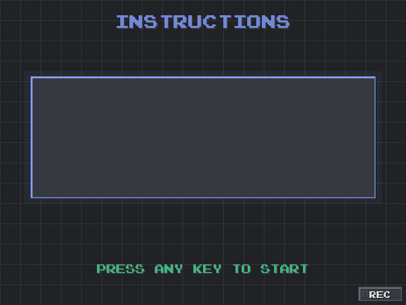

                                                                                                                                # Test Your Brain Age · Pygame 反应力小游戏

一款像素风的反应训练迷你游戏：随机在区域内出现带颜色与文字的方块，判断“颜色是否与文字一致”，并尽快按下对应按键或点击。支持音效/BGM、像素字体、倒计时、评分与连击、结果统计、脑年龄判定，以及设置与本地持久化。

## 目录
- 功能亮点
- 截图预览
 - 动图演示（GIF）
- 玩法介绍
- 快速开始（Windows）
- 操作说明
- 计分与连击规则
- 设置与数据持久化
- 常见问题
- 截图采集指南

## 功能亮点
- 3-2-1-GO 倒计时与提示音
- 键盘与鼠标两种判定路径，一致的评分与音效
- 反应时间分档：Perfect/Good/Slow，并有粒子特效（Perfect）
- 连击显示：仅在连击（≥2）时，屏幕中央短暂显示“COMBO! +2”
- 结果页展示总分、最大连击、反应时间统计与脑年龄判定
- 排行榜页面（按分数与平均反应时间排序）
- 设置页面：BGM 开关、BGM 音量、SFX 音量，变更即时生效并持久化
- 兼容无 NumPy 环境的纯 Python 音频回退

## 截图预览
将截图放到 `assets/screenshots/` 目录下，文件名按下列约定命名。README 会自动引用这些路径（若文件尚未放置，图片将无法显示）。

- 标题界面（Title）
  
- 输入昵称（Name Input）
  
- 说明/倒计时（Instructions / Countdown）
  
  
- 游戏进行中（Gameplay）
  
- 结果页面（Results）
  
- 排行榜（Rankings）
  
- 设置页面（Settings）
  

## 动图演示（GIF）
将动图放到 `assets/gifs/` 目录下，命名建议如下（放置后 README 会自动引用）：

- 标题/输入名（Title/Name Input）
  
- 说明与倒计时（Instructions + Countdown）
  
- 游戏过程（连击与 Perfect 展示）
  
- 结果与排行榜（Results + Rankings）
  
- 设置页面（Settings）
  

录制建议（Windows）：
- ScreenToGif（推荐）：选择区域录制 → 保存为 GIF；可在“编辑器”里裁剪、降帧、缩放。
- ShareX：Capture → Screen recording (GIF)。
- 尺寸与体积：尽量控制在 6–8 MB 以内；可减小录制区域、降低帧率（10–15 FPS）或缩小分辨率（≤720p）。

内置快捷录制（可选）：运行游戏时按 R 键 或 点击右下角的 REC 按钮 开始/停止录制，程序会以约 12 FPS 将帧保存到 `assets/gifs/` 并尝试自动合成对应 GIF（如未安装 imageio，则会保留 PNG 帧，并在界面顶部提示）。

重新录制 README 中的 GIF（将覆盖同名文件）：
- 标题页/输入名（title_intro.gif）：进入标题界面后，按一次 REC 开始，展示 2–4 秒画面后再次按 REC 停止。
- 说明 + 倒计时（instructions_countdown.gif）：在“INSTRUCTIONS”页按任意键触发 3-2-1-GO 倒计时，过程中按 REC 开始，GO 后约 1 秒按 REC 停止。
- 游戏过程（gameplay_combo_perfect.gif）：游戏开始后，等待出现有效块，尽量连续命中 2 次以触发 COMBO，并争取一次 Perfect；期间按 REC 开始/结束。
- 结果 + 排行榜（results_rankings.gif）：结果页展示完成后按任意键进入排行榜，期间按 REC 开始，切换到排行榜后再按 REC 停止。
- 设置页（settings.gif）：在排行榜按 S 打开设置页，按 REC 开始，展示滑动音量与开关，再按 REC 停止。

提示：
- 录制会覆盖 `assets/gifs/` 下的同名 GIF 文件（若存在）。
- 若看到 `assets/gifs/_tmp_时间戳/` 残留，可手动删除不需要的临时帧目录。

## 玩法介绍
- 游戏目标：在有时间压力的情况下，快速而准确地判断“方块上的文字”与“方块本身的颜色”是否一致，并尽可能获得更高分与更快的平均反应时间。
- 基本流程：
  1) 输入昵称 → 进入说明页。
  2) 任意键开始倒计时：3、2、1、GO（均有提示音）。
  3) 正式开始后，会依次出现 10 个方块；每个方块短暂停留，随后进入间隔再出现下一个。
  4) 完成后进入结果页，展示总分、最大连击、反应时间统计与“脑年龄”评估；任意键进入排行榜，可从排行榜进入设置。
- 判断规则：
  - 只有当“方块文字的含义”和“方块实际颜色”一致时，才需要按键/点击（这是有效目标）。
  - 不一致的为干扰块：点击会扣分；忽略它们不会扣分也不会打断节奏。
- 操作方式：
  - 键盘：按 R/G/B/Y 与颜色对应；或使用鼠标直接点击有效目标。
  - 点击或按键后，该方块立即消失并进入间隔。
- 时间节奏与遗漏：
  - 每个方块只在屏幕上保留短时间；若在可见时间内未点中有效目标，不扣分，但会打断连击（若该块本应点击）。
- 反应评级（影响反馈与特效）：
  - Perfect：反应时间 < 0.28s（额外 +1 分，并触发粒子特效与更强反馈）。
  - Good：0.28s ≤ 反应时间 < 0.45s。
  - Slow：≥ 0.45s（含更慢的回应）。
- 计分与连击（与代码逻辑一致）：
  - 第一击（或断连后的首击）：+1。
  - 连击状态（streak ≥ 2）下的每次命中：+2。
  - Perfect 额外：+1（在上述基础上叠加）。
  - 误点（点到干扰块或按错键）：-1，并清空连击。
  - 漏点（有效目标没来得及点）：不扣分，但会断连。
- 连击展示：仅当处于连击（≥2）时，屏幕中央会短暂显示“COMBO! +2”；不在方块旁显示 “+1” 的小框，以避免视觉干扰。
- 结束与评估：10 个方块结束后，结果页会给出脑年龄推断（结合得分与平均反应时），并可继续查看排行榜或进入设置页面微调音量等。

## 快速开始（Windows）
1) 安装依赖（NumPy 可选；自动合成 GIF 需要 imageio/pillow 可选装）：

```powershell
python -m pip install pygame
python -m pip install numpy   # 可选（启用更平滑的音频路径）
python -m pip install imageio pillow   # 可选（自动合成 GIF）
```

2) 运行游戏：

```powershell
python .\ReactionTest_Mini-Game(1).py
```

如遇声音初始化失败，游戏将自动启用纯 Python 音频回退并继续运行。

## 操作说明
- 键盘：根据“方块颜色”按下对应按键（R/G/B/Y）。
- 鼠标：直接点击“颜色与文字一致”的方块。
- 其它：任意键开始（倒计时后进入游戏），结果页任意键进入排行榜；排行榜中按 S 进入设置，Esc 退出。

## 计分与连击规则
- 首次命中或断后重启的第一击：+1
- 连击（streak ≥ 2）时每击：+2
- Perfect（极快反应）额外：+1（叠加在上述基础分之上）
- 失误：-1，并打断连击
- 连击提示：仅在连击时屏幕中央显示“COMBO! +2”（不显示 +1 方框）

## 设置与数据持久化
- 设置项：BGM 开关、BGM 音量、SFX 音量；变更会实时应用。
- 数据文件：保存在用户目录下 `~/.reaction_mini/data.json`，包含排行榜与设置。

## 常见问题
- 启动时报 `numpy` 未安装：忽略即可，已内置纯 Python 的音频回退。
- 没声音/卡顿：检查系统输出设备；必要时降低 BGM 音量或关闭 BGM。
- 字体不清晰：游戏已使用像素字体与邻近插值缩放；如需更大的字号，可调整源码中的 `FONT_SCALE`。

## 截图采集指南
- 建议的文件名：
  - `assets/screenshots/title.png`
  - `assets/screenshots/input_name.png`
  - `assets/screenshots/instructions.png`
  - `assets/screenshots/countdown.png`
  - `assets/screenshots/gameplay.png`
  - `assets/screenshots/results.png`
  - `assets/screenshots/rankings.png`
  - `assets/screenshots/settings.png`
- Windows 截图建议：按下 `Win + Shift + S` 使用系统截屏工具；或使用 `PrtSc`/`Alt + PrtSc` 再粘贴保存。
- 若想在代码中保存截图，可参考 `pygame.image.save(SCREEN, "path.png")`（在合适的渲染帧调用）。

---
如需我帮你自动抓取并导出这些截图，也可以告诉我你希望的尺寸和风格，我可以临时在代码里加入快捷键来一键导出。