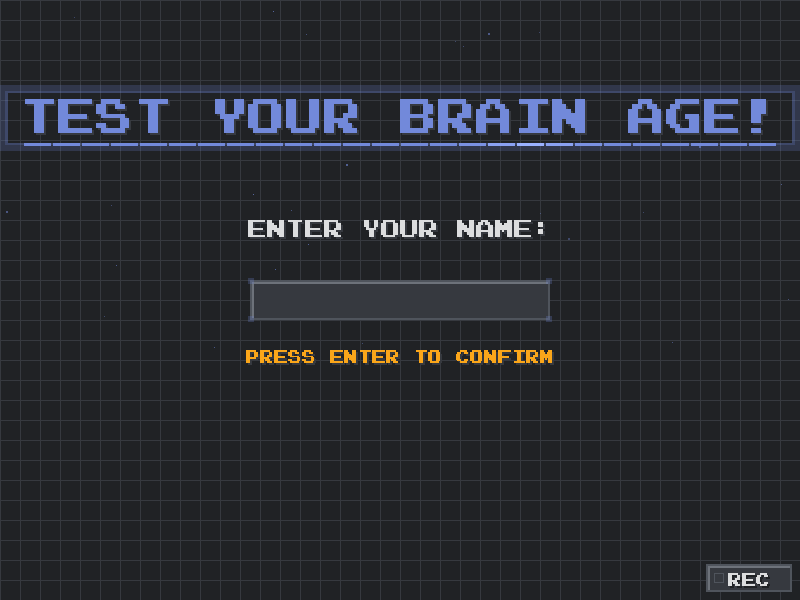
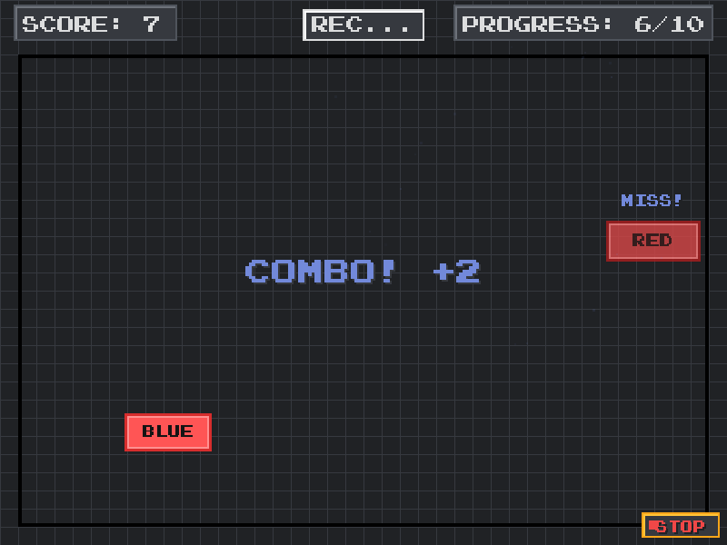
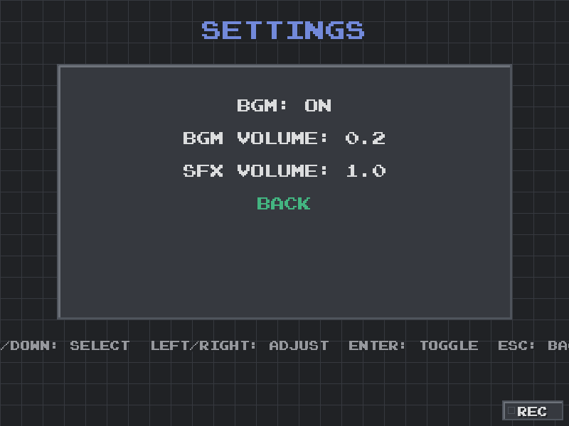

# Test Your Brain Age · Pygame Reaction Mini‑Game

A pixel‑style reaction training mini‑game. Colored blocks with color names randomly appear on screen — decide whether the text matches the block color and act quickly. Includes SFX/BGM, pixel fonts, 3‑2‑1‑GO countdown, scoring and combos, results, “brain age” estimation, settings, and local persistence.

## Table of Contents
- Features
- Screenshots
- Animated demos (GIF)
- How to play
- Quick start (Windows)
- Controls
- Scoring and combo rules
- Settings & data persistence
- FAQ
- Capture guide

## Features
- 3‑2‑1‑GO countdown with beeps (the “3” beeps immediately)
- Keyboard and mouse input paths with identical scoring and SFX
- Reaction grading: Perfect / Good / Slow; Perfect has particle effects
- Combo indicator: only during streaks (≥2) a centered “COMBO! +2” pops up briefly
- Results page: total score, max combo, reaction time stats, and brain‑age estimation
- Rankings page (sorted by score and then average reaction time)
- Settings page: BGM on/off, BGM volume, SFX volume — applied live and persisted
- Robust audio fallback without NumPy (pure‑Python path)

## Screenshots
Place screenshots in `assets/screenshots/` with the following names. The README references these paths (images won’t display until files are present).

- Title
  
- Name Input
  
- Instructions / Countdown
  
  
- Gameplay
  
- Results
  
- Rankings
  
- Settings
  

## Animated demos (GIF)
Put GIFs under `assets/gifs/` with these names (the README will reference them automatically):

- Title / Name Input
  
- Instructions + Countdown
  
- Gameplay (Combo + Perfect)
  
- Results + Rankings
  
- Settings
  

Recording tips (Windows):
- ScreenToGif (recommended): region record → save as GIF; crop/trim/scale inside the editor.
- ShareX: Capture → Screen recording (GIF).
- Size and weight: keep within ~6–8 MB when possible; reduce crop area, lower FPS (10–15), or scale down (≤720p).

Built‑in quick recorder (optional): while the game is running, press R or click the REC button at the bottom‑right to start/stop recording. Frames are saved at ~12 FPS to `assets/gifs/` and the game attempts to assemble a GIF automatically if imageio/pillow are installed (otherwise PNG frames are kept and a small on‑screen hint appears).

Re‑record the README GIFs (will overwrite files with the same names):
- title_intro.gif: on the title screen, press REC to start, show 2–4 seconds, then press REC to stop.
- instructions_countdown.gif: on “INSTRUCTIONS”, press any key to trigger 3‑2‑1‑GO, press REC during the countdown, and stop ~1s after “GO!”.
- gameplay_combo_perfect.gif: once gameplay begins, hit two valid blocks in a row to trigger COMBO and try to get a Perfect; record an appropriate slice.
- results_rankings.gif: after results are shown, press any key to enter rankings; record the transition and stop in the rankings page.
- settings.gif: in rankings, press S to open settings; record a short volume/ toggle demonstration and stop.

Tips:
- Recording will overwrite files under `assets/gifs/` with the same names.
- If you see leftover temp folders like `assets/gifs/_tmp_<timestamp>/`, you can delete the ones you don’t need.
- Bonus: press F9 to auto‑record all the showcase GIFs end‑to‑end (optional).

## How to play
- Goal: under time pressure, quickly and accurately decide whether the text on a block matches the block’s color. Aim for higher scores and faster average reaction times.
- Flow:
  1) Enter your name → go to the instructions page.
  2) Press any key to start the countdown: 3, 2, 1, GO (with beeps).
  3) 10 blocks are shown one by one; each stays briefly, then an interval before the next.
  4) After 10 blocks, the results page shows your total score, max combo, reaction time stats, and a brain‑age estimate; press any key to go to rankings, and from there you can open settings.
- Rules:
  - Only when the meaning of the text matches the actual block color should you press/click (this is a valid target).
  - Mismatches are distractors: clicking them deducts points; ignoring them doesn’t deduct points nor break the rhythm.
- Input:
  - Keyboard: press R/G/B/Y matching the color; or use the mouse to click valid targets.
  - After a press/click, the block immediately disappears and the interval begins.
- Timing and misses:
  - Each block stays visible for a short time; if a valid target is missed within that window, no points are deducted, but a streak (if any) will break.
- Reaction grading (affects feedback and effects):
  - Perfect: reaction time < 0.28s (extra +1 and particle effects)
  - Good: 0.28s ≤ t < 0.45s
  - Slow: ≥ 0.45s

## Quick start (Windows)
1) Install dependencies (NumPy optional; imageio/pillow optional for auto GIF assembly):

```powershell
python -m pip install pygame
python -m pip install numpy   # optional (enables smoother audio path)
python -m pip install imageio pillow   # optional (auto‑assemble GIFs)
```

2) Run the game:

```powershell
python .\ReactionTest_Mini-Game.py
```

If audio initialization fails, the game automatically falls back to a pure‑Python audio path and continues running.

## Controls
- Keyboard: press the color‑matching key (R/G/B/Y) when text equals color.
- Mouse: click valid targets directly.
- Others: any key to begin (after the countdown), any key on results to go to rankings; in rankings press S to open settings, Esc to quit.

## Scoring and combo rules
- First hit (or first after a broken streak): +1
- During a streak (streak ≥ 2): +2 per hit
- Perfect bonus: +1 (added on top of the above)
- Mistake: −1 and the streak resets
- Combo hint: only show “COMBO! +2” in the center during streaks (no small “+1” labels near blocks)

## Settings & data persistence
- Settings: BGM on/off, BGM volume, SFX volume; changes apply live.
- Data file: stored at `~/.reaction_mini/data.json`, including rankings and settings.

## FAQ
- “numpy not installed” at startup: ignore — a pure‑Python audio fallback is built in.
- No sound / stutter: check your output device; reduce BGM volume or turn BGM off if needed.
- Pixel font looks small: the game uses a pixel font and nearest‑neighbor scaling; increase `FONT_SCALE` in the source if you need larger sizes.

## Capture guide
- Suggested file names:
  - `assets/screenshots/title.png`
  - `assets/screenshots/input_name.png`
  - `assets/screenshots/instructions.png`
  - `assets/screenshots/countdown.png`
  - `assets/screenshots/gameplay.png`
  - `assets/screenshots/results.png`
  - `assets/screenshots/rankings.png`
  - `assets/screenshots/settings.png`
- Windows: use `Win + Shift + S` (Snipping Tool) or `PrtSc`/`Alt + PrtSc` then paste to save.
- In‑code capture (optional): call `pygame.image.save(SCREEN, "path.png")` on a suitable frame.

